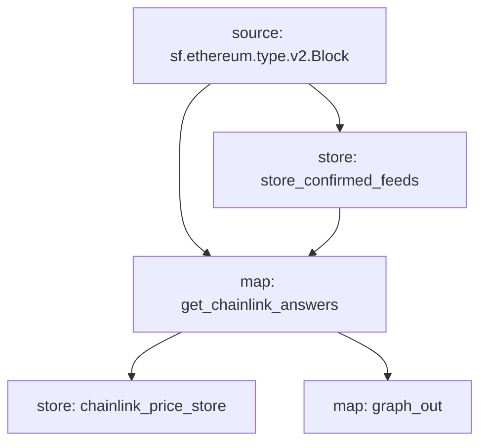

Chainlink Price Substream Powered Subgraph
======================

Install [`substreams` and its dependencies here](https://substreams.streamingfast.io/getting-started/installing-the-cli), compile these modules with:

```
# We assume you are at root of project
cargo build --target=wasm32-unknown-unknown --release
```

Run with:

```
substreams run -e mainnet.eth.streamingfast.io:443 substreams.yaml graph_out
```

> This will ouput the entity changes for integration with The Graph.  Please see here on how to deploy to The Graph: https://thegraph.com/docs/en/cookbook/substreams-powered-subgraphs/

## Visual data flow

This is a flow that is executed for each block.  The graph is produced with `substreams graph ./substreams.yaml`.

